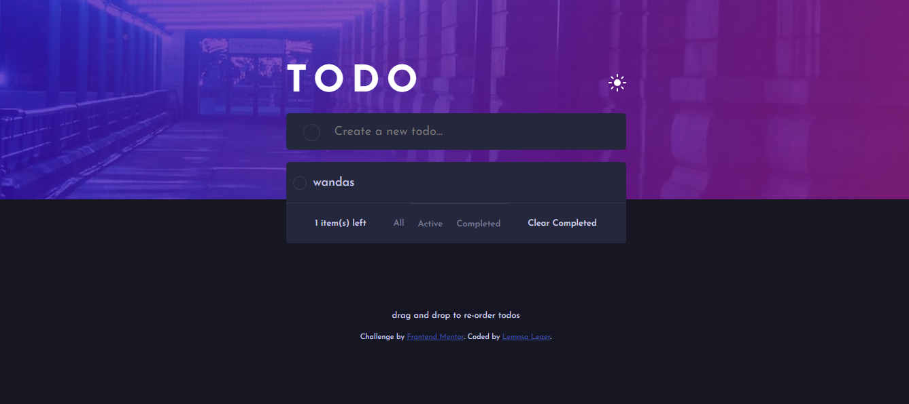

# Frontend Mentor - Todo app solution

This is a solution to the [Todo app challenge on Frontend Mentor](https://www.frontendmentor.io/challenges/todo-app-Su1_KokOW). Frontend Mentor challenges help you improve your coding skills by building realistic projects. 

## Table of contents

- [Overview](#overview)
  - [The challenge](#the-challenge)
  - [Screenshot](#screenshot)
  - [Links](#links)
- [My process](#my-process)
  - [Built with](#built-with)
  - [What I learned](#what-i-learned)
  - [Continued development](#continued-development)
  - [Useful resources](#useful-resources)
- [Author](#author)
- [Acknowledgments](#acknowledgments)

**Note: Delete this note and update the table of contents based on what sections you keep.**

## Overview

### The challenge

Users should be able to:

- View the optimal layout for the app depending on their device's screen size
- See hover states for all interactive elements on the page
- Add new todos to the list
- Mark todos as complete
- Delete todos from the list
- Filter by all/active/complete todos
- Clear all completed todos
- Toggle light and dark mode
- **Bonus**: Drag and drop to reorder items on the list

### Screenshot

### Links

- Solution URL: [solution URL here](https://github.com/LemnsaLeger/TODO-APP)
- Live Site URL: [live site URL here](https://lemnsaleger.github.io/TODO-APP/)

## My process

### Built with

- Semantic HTML5 markup
- CSS custom properties
- Flexbox
- Vanilla Js
- Mobile-first workflow

### What I learned

Drag and Drop event type.

### Continued development

WebbApp that uses external data APIs.

### Useful resources

- [The Odin Project](https://www.theodinproject.com) - This helped me for JS. I really liked this resource and will use it going forward.

## Author

- Website - [Lemnsa Leger](https://lemnsaleger.github.io/Personal-Website-Homepage/)
- Frontend Mentor - [@Leger](https://www.frontendmentor.io/profile/leger)
- Twitter - [@devlemnsa](https://www.twitter.com/@devlemnsa)

## Acknowledgments

A big shout to the TheOdinProject and FrontEndMentor for learning and real projects resources respectively.
